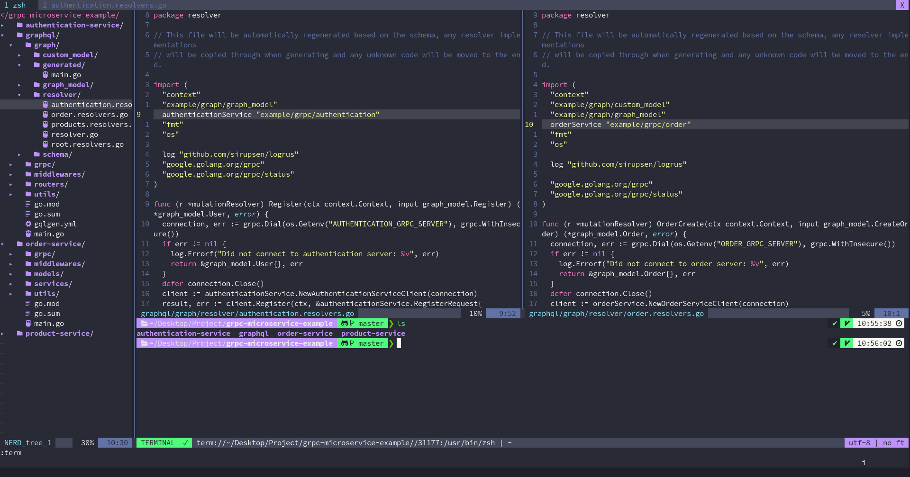

## Require

`nvim >= 0.5`

`code-minimap` For minimap support

`ripgrep` For word search

## Install

clone to `~/.config/nvim`

## Plug

### Update vim-plug

`:PlugUpgrade`

### Install plugin

`:PlugInstall`

### Update plugin

`:PlugUpdate`

## Screenshot

